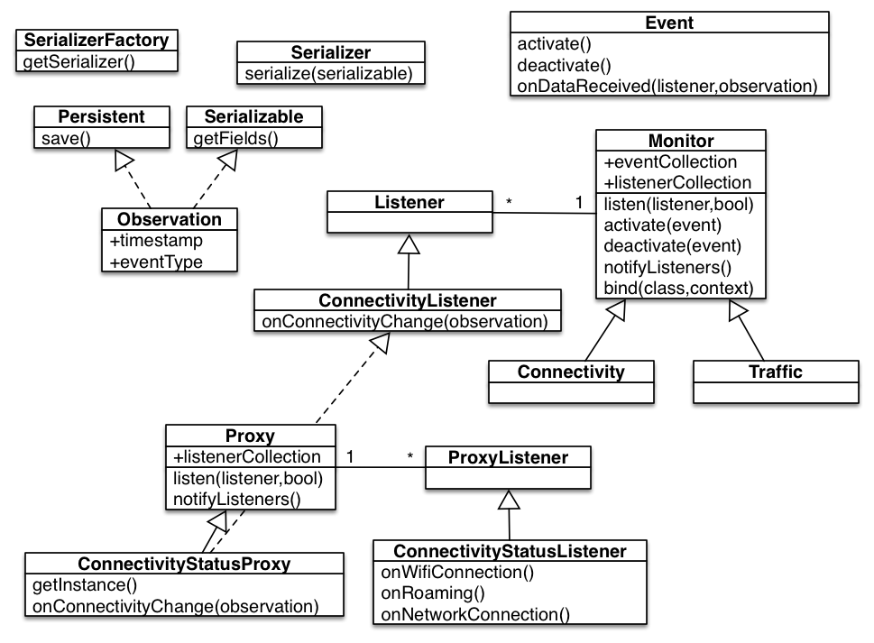

Adkintun Mobile Middleware
==========================

Android Middleware for performing mobile sensing and monitoring. Originally created for the [Adkintun Mobile](http://www.adkintunmobile.cl) project, it is released under the [Apache Open Source License](http://www.apache.org/licenses/LICENSE-2.0.html) to be used by developers in their own software projects.

Software Architecture
----------------------

The general structure of the library is shown in the following figure ...

he following requirements guided the actual design and development of the middleware:
* extensibility, in order to add monitoring for new events with ease and requiring minimal modification of the existing code,
* small memory footprint, by storing the sensor data in memory the shortest time possible,
* ease of use, to integrate monitoring in an application as quickly as possible,
* component independence, we wanted the different components of the application to be as independent as possible. As an example, even though we may want to be able to save monitoring data to a database, we would not want to be restricted to using [SQLite](http://www.sqlite.org/) or to be obligated to use a database by design.
* Data exporting capabilities, in order to easily export data from different devices into multiple formats,
* reliability of data, we need to be able to trust that events occur when the library says they are monitored, thus the sequence of reporting and the time of reporting must be reliable.

The general design of the middleware is inspired by the [AWARE Framework](http://www.awareframework.com/), and some of the code for the different monitors was based on that project, given that they already had resolved many of the issues related to Android development. However that framework did not fulfill all of our requirements, motivating the development the present library.

The structure of the main entities in the middleware is shown on Figure above, where the architecture of the central classes follows the observer and factory patterns. A general description of the different entities is provided below.

* The central class of the library is `Monitor`, defining the general structure for all monitoring classes, which will perform the task of listening to OS events. This class extends from the Android [Service](http://developer.android.com/guide/components/services.html) class, thus allowing each monitor to run as a daemon of the system. 
* A monitor can observe one or more `Events` of the Operating System. Events define different aspects of a monitoring task. For instance, the `Traffic` monitor can observe events of mobile traffic, WiFi traffic or application traffic, and a developer using the library may choose to activate a different one depending on the application.
* A `Listener` can be attached to a monitor, in order to be notified of new observations from an event,
* the notification usually comes in the form of an `Observation` object, carrying data about the event as well as the timestamp, and event type (a code to identify the event). 
* Observations can be `Persistent`, meaning they can be saved to a local database (SQLite for now) if desired, 
* they are also `Serializable`, meaning they can be exported to different formats (JSON, CSV, etc.).
* Preprocessing of observations to establish a context can be performed through the definition of `Proxy` objects, which can listen to multiple monitors in order to notify their own listeners of a specific context. One example of these objects is the `ConnectivityStatusProxy` which compares two consecutive connectivity observations and notifies its listeners of a change in connectivity or roaming status.

Scheduling of notifications is performed to ensure that observations arrive in the correct order, and periodical NTP synchronization is implemented to ensure that the reported timestamp of the events is correct.

Dependencies
------------

Usage
-----

Configuration
-------------

